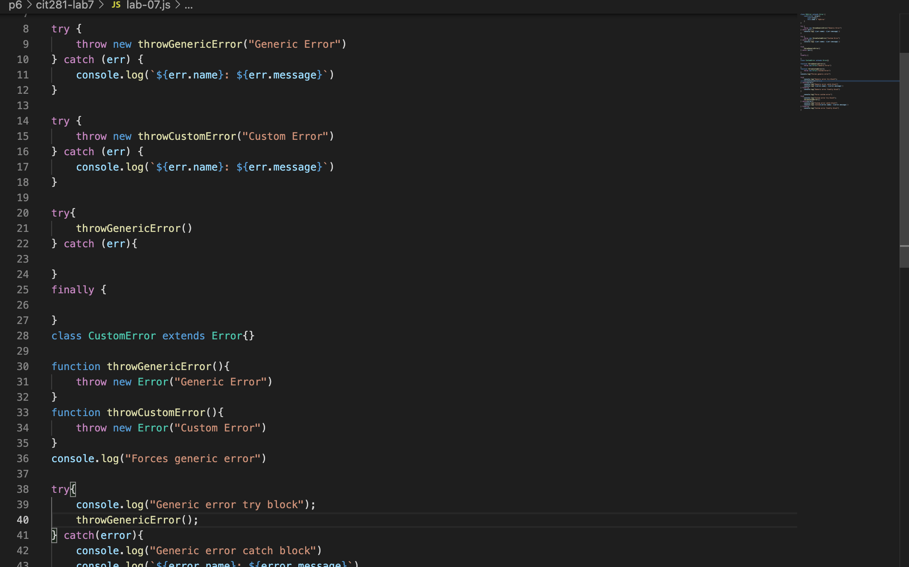

## Welcome to Lab7

This weeks lab we were introduced GitHub. How to create an organization, repository and clone our files. As well learn about try..catch..finally and throw.

Lab goals and outcomes:

Part 1: Create your own GitHub organization for the CIT Minor

Part 2: Create your first GitHub repository

Part 3: Clone your GitHub repository to your local system

Part 4: Create lab JavaScript file, and initialize folder as a Node.js folder

Part 5: Update and commit lab JavaScript file to practice with error handling

Part 6: Push your changes to GitHub

